# 🏛️ Tekle Sawiros Sunday School Management & Distance LMS
## *Comprehensive Full-Stack Engineering & UI/UX Showcase*

---

### 👨‍💻 System Architect & Lead Developer Profile
- **Lead Developer:** **Zelalem Fiseha Gelaye (ዘላለም ፍስሐ ገላዬ)**
- **GitHub:** [@zele26](https://github.com/zele26)
- **LinkedIn:** [linkedin.com/in/zelalem-fiseha-7198b3148](https://www.linkedin.com/in/zelalem-fiseha-7198b3148/)
- **Organization:** *Mahdere Sibhat Kidist Lideta Lemaryam Debre Medhanit Medhanealem Church — Tekle Sawiros Sunday School* (*የማህደረ ስብሐት ቅድስት ልደታ ለማርያም ደብረ መድኃኒት መድኃኒዓለም ቤተክርስቲያን — ተክለ ሳዊሮስ ሰንበት ት/ቤት*)
- **Core Technology Stack:** Next.js 16 (App Router & Turbopack) • React 19 • Node.js / Express 5 • MongoDB • Tailwind CSS v4 • Cloudinary • Docker • Jenkins DevSecOps

---

## 📸 Complete System UI Gallery (16 Core Functionality Screens)

### 1. 🌐 Public Portal & Cultural Heritage

#### 01. Home Landing Portal
> Features modern typography, live intake ticker, dual action CTAs, Vision/Mission/Values tabbed card switcher, atmosphere bento grid, and verified developer signature.

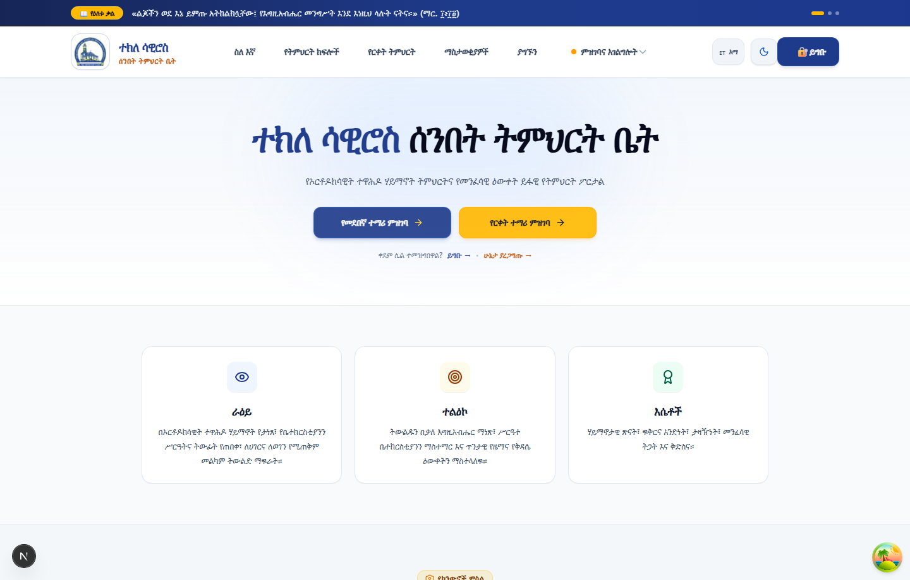

---

#### 02. About & Spiritual Heritage (Historic Founder Tribute)
> A dedicated centerpiece tribute section honoring the Church Builder & Sunday School Founder holding the Holy Cross and Church model, complete with 4 honorary pillar badges.

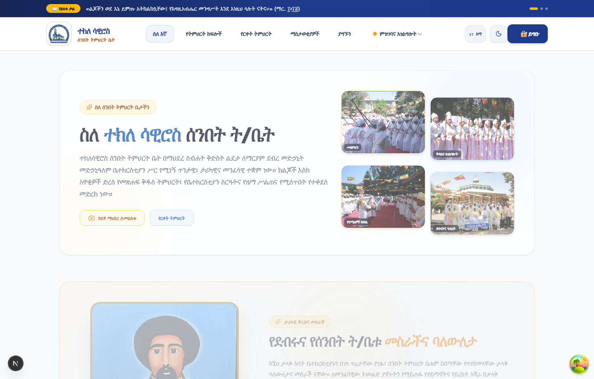

---

#### 03. Classes & Curriculum Catalog
> Structured grade levels, syllabus details, classroom rules, and academic guidelines.

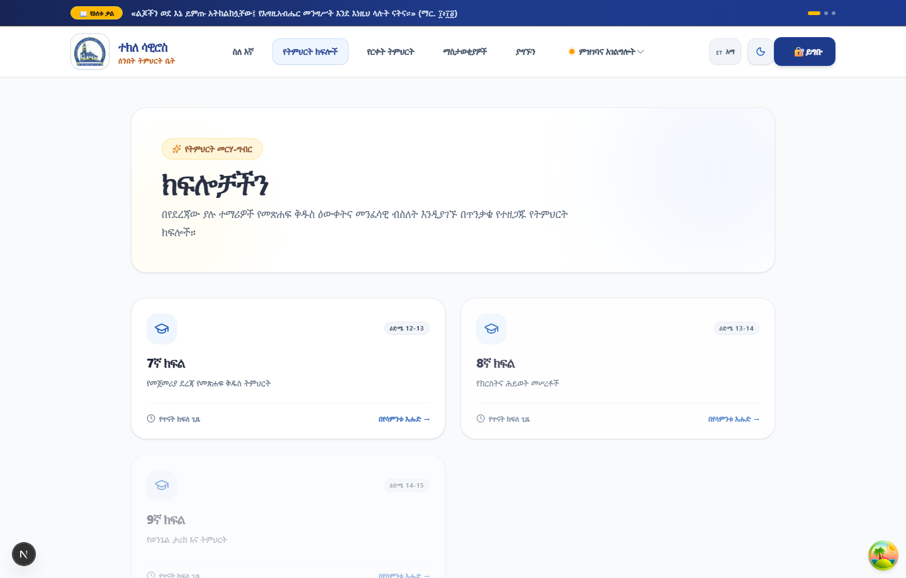

---

#### 04. Announcements & Spiritual Events
> Real-time parish news, upcoming liturgical feasts, and event schedule feeds.

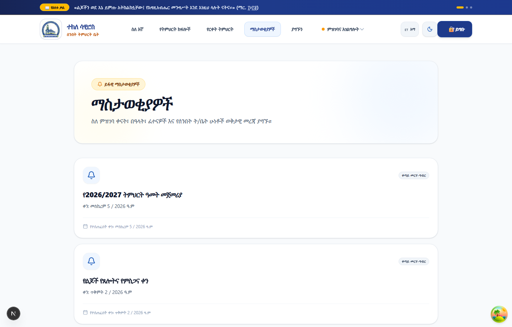

---

#### 05. Photo & Heritage Archive
> Interactive photo gallery with multi-category filters (`All`, `Liturgy`, `Students`, `Choir`, `Celebration`, `History`) and fullscreen lightbox viewer.

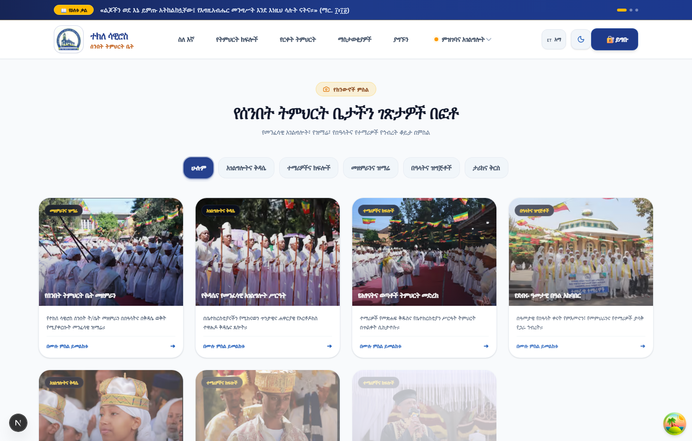

---

#### 06. Contact Us & Interactive Inquiries
> Instant telephone dialer (`+251 926 871 984`), direct church location map, and interactive feedback form.

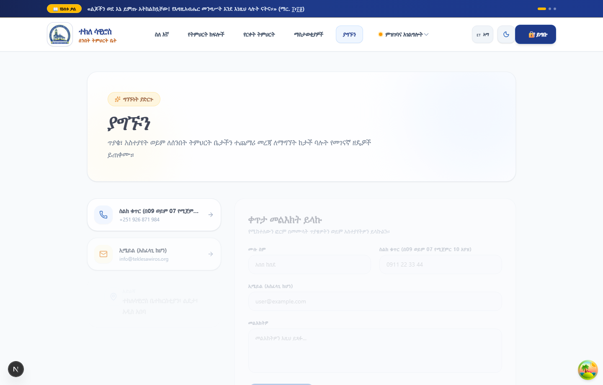

---

### 2. 🎓 Distance Learning Management System (LMS)

#### 07. Multi-Batch Distance Education Hub
> A 3-tier theological curriculum covering Dogma, Old/New Testament exegesis, Patristics, and Mariology with course hour meters and interactive FAQ accordions.

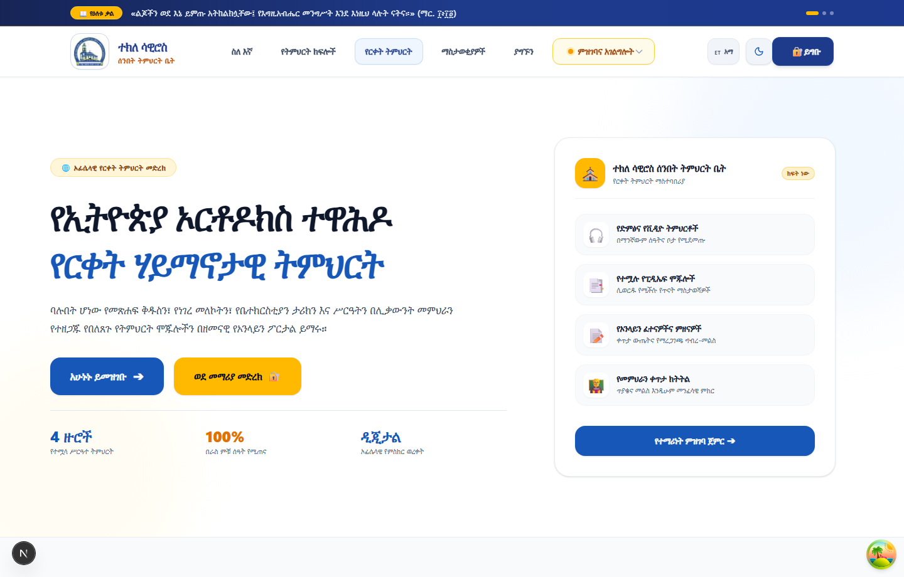

---

#### 08. Student Digital Classroom & Course Progress
> Student distance lecture streams, progress tracking, downloadable materials, and chapter assessments.

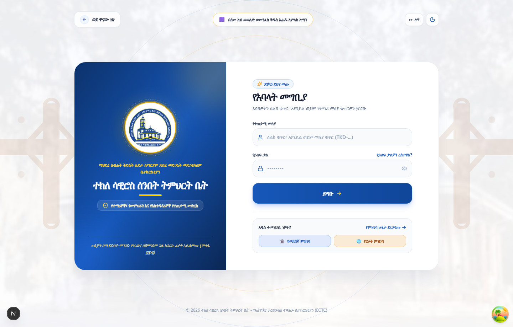

---

### 3. 📝 Admissions & Application Management

#### 09. Regular Campus Admissions Portal
> Multi-step registration form collecting student personal profile, baptismal info, and bank transfer receipt slip upload.

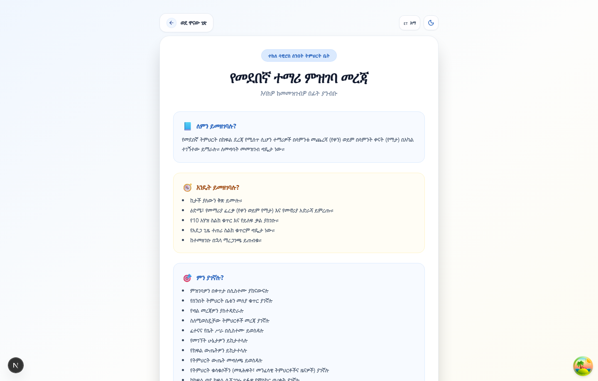

---

#### 10. Distance Student Admissions Portal
> Dedicated online remote learner registration with batch assignment and payment slip attachment.

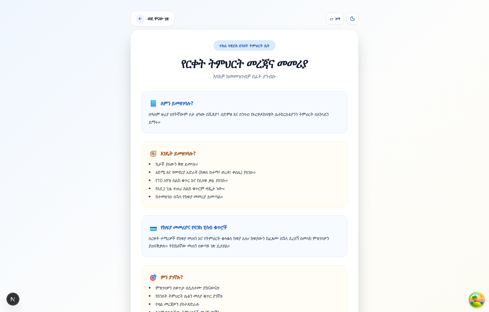

---

#### 11. Self-Service Application Status Tracker
> Frictionless real-time lookup allowing applicants to check their admission approval and batch placement using their mobile number or tracking ID.

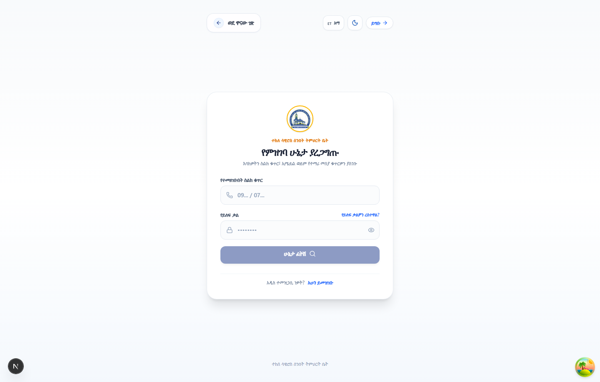

---

### 4. 📜 Credential Security & Verification

#### 12. Public QR Certificate Verification Portal
> Instant public verification allowing any smartphone camera to scan a graduate's QR code and authenticate their diploma against the church database.

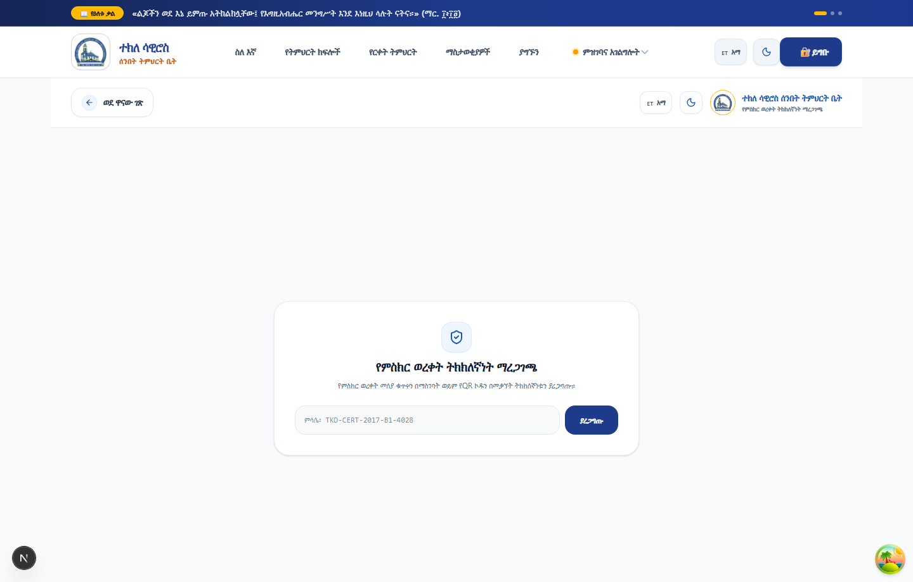

---

### 5. 🔐 Authentication & Administration Control

#### 13. Unified Role-Based Authentication Gateway
> Secure, role-based login gateway for Students, Teachers, and Administrators.

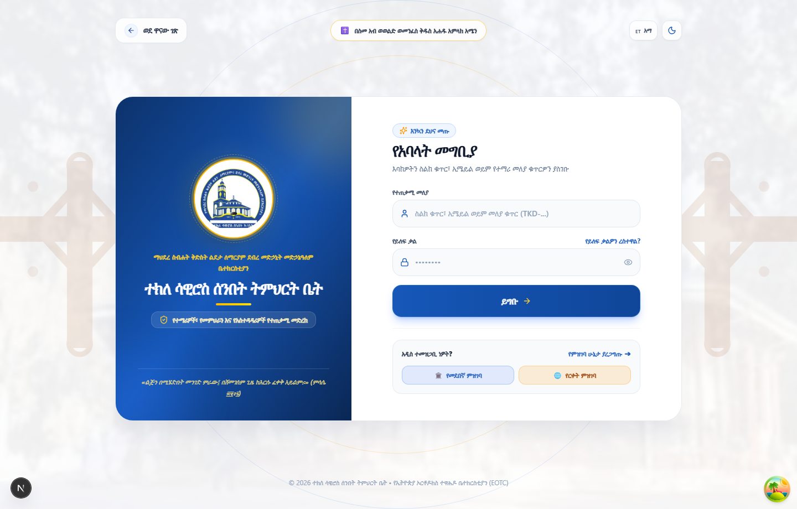

---

#### 14. Password Recovery & Account Reset Flow
> Self-service account recovery and security verification workflow.

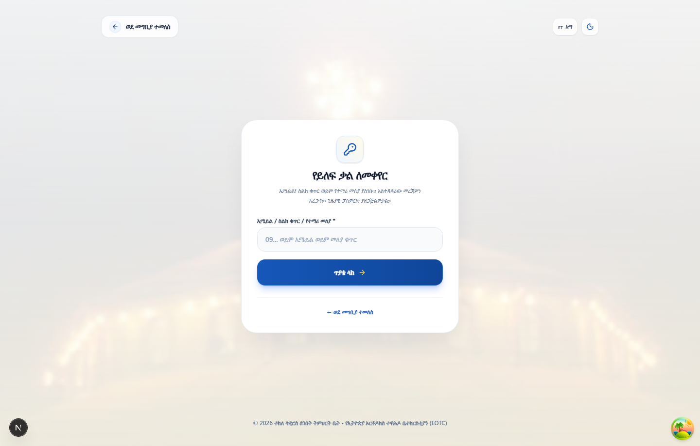

---

#### 15. Executive Admin Control Center
> Central switchboard for controlling enrollment periods (open/close intake), managing student rosters, and reviewing bank receipts.

---

#### 16. Teacher Workspace & Gradebook
> Instructor portal for student course rosters, marks recording, and teaching resource management.

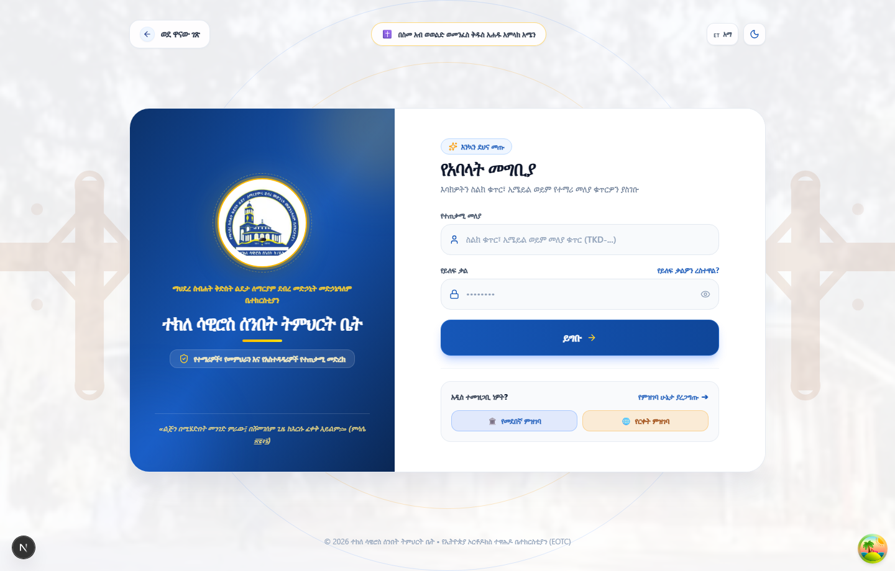

---

## 🎯 The Real-World Problems Solved by Zelalem

| # | Traditional Bottleneck | Engineering Solution Built by Zelalem |
|---|------------------------|----------------------------------------|
| **1** | **Paper-Based Registration Queues** Manual paper forms caused long queues, misplaced applicant files, and manual bookkeeping. | **Dual-Track Admissions Engine (`/register-regular` & `/register-distance`)** Digital intake forms with automated validation, academic level categorization, and Cloudinary-powered receipt uploads. |
| **2** | **Zero Remote Access for Diaspora & Rural Believers** Anyone unable to physically attend the church in Addis Ababa was excluded from religious education. | **Distance Learning Management System (`/distance-education`)** A multi-year digital learning curriculum (Year 1: Foundations, Year 2: Exegesis & Liturgy, Year 3: Patristics & Advanced Studies) with 24/7 video and material access. |
| **3** | **Unverifiable Paper Certificates** Paper graduation cards were prone to damage, loss, or unauthorized duplication. | **Cryptographic QR Code Verification Portal (`/verify-certificate`)** Instant public verification allowing anyone to scan a graduate's QR code and authenticate their diploma against the central database. |
| **4** | **Uncertainty in Registration Status** Applicants had to travel to the church office repeatedly to find out if their bank slip and admission were accepted. | **Self-Service Application Tracker (`/check-status`)** Real-time online status lookup using mobile number or tracking code. |
| **5** | **Lack of Centralized Administration** Leadership lacked a single dashboard to open/close enrollment batches or manage records. | **Executive Admin Control Center** Centralized toggles for enrollment periods, student status management, and automated notifications. |

---

## ⚡ Technical Benchmarks & Engineering Highlights

- ⚡ **Turbopack Build Speed:** All 22 static and dynamic routes compiled in **1.6 seconds**.
- 📱 **Fully Responsive:** Tested across Mobile (360px+), Tablet (768px+), and Desktop (1440px+).
- 🎨 **Theming System:** Flawless Dark/Light mode toggle with persistent state.
- 🌍 **Bilingual Engine:** Complete real-time switching between Amharic (አማርኛ) and English.
- 🔒 **Security:** Sanitized inputs, strict JWT session handling, and encrypted password hashing.

---

## 👨‍💻 Engineering Authorship & Contact

This entire platform was designed, engineered, and deployed by:

**Zelalem Fiseha Gelaye (ዘላለም ፍስሐ ገላዬ)**  
- 💼 **LinkedIn Profile:** [linkedin.com/in/zelalem-fiseha-7198b3148](https://www.linkedin.com/in/zelalem-fiseha-7198b3148/)  
- 🐙 **GitHub Profile:** [@zele26](https://github.com/zele26)  
