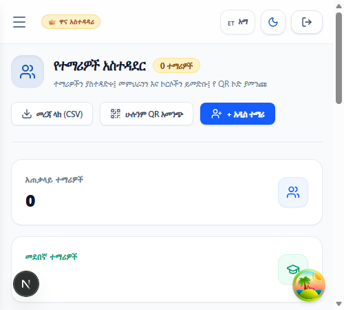
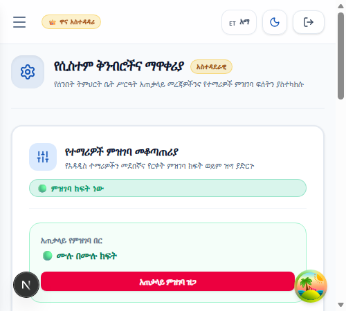

# Tekle Sawiros Sunday School Management & Distance LMS
### A Full-Stack Platform for Church Education & Administration

**Developer:** Zelalem Fiseha Gelaye ([GitHub](https://github.com/zele26) • [LinkedIn](https://www.linkedin.com/in/zelalem-fiseha-7198b3148/))  
**Focus:** Full-Stack Engineering & DevSecOps Practices  
**Organization:** Mahdere Sibhat Kidist Lideta Lemaryam Debre Medhanit Medhanealem Church — Tekle Sawiros Sunday School (Addis Ababa, Ethiopia)  
**Tech Stack:** Next.js 16, React 19, Node.js, Express, MongoDB, Tailwind CSS, Cloudinary, Docker, Jenkins, HashiCorp Vault, Harbor, Trivy, ArgoCD, OpenShift

---

## 📌 Project Background & Motivation

For years, our Sunday school operated entirely on paper. Every registration season meant long lines, misplaced paper forms, manual bank receipt verification, and difficulty tracking student attendance and grades. On top of that, church members living abroad or outside the city had no way to participate in our courses.

I built this project to solve these practical problems, modernize church operations, and establish an automated, secure **DevSecOps delivery pipeline** that ensures high availability, security, and continuous compliance.

---

## 🎯 What Problems This Solves

1. **Eliminating Paper Registration & Queues**  
   Students can now register online for regular or distance learning, choose their class, and upload their bank transfer receipts directly.

2. **Distance Learning for Diaspora & Remote Students**  
   A structured multi-year curriculum (Theology, Church History, Sacraments, Biblical Studies) with online lessons, study materials, and assessments.

3. **Verifiable Certificates (Preventing Credential Forgery)**  
   Graduation certificates come with unique QR codes. Anyone can scan the code to instantly verify student details and completion on our public portal.

4. **Self-Service Status Tracking**  
   Applicants can check if their admission or payment slip has been approved simply by entering their phone number or registration code.

5. **Central Role-Based Portals for Admins, Teachers & Students**  
   Dedicated authenticated workspaces: Admins control intake switches and manage student records; Teachers record grades and take attendance; Students access distance video lectures and quizzes.

---

## 🛡️ DevSecOps Architecture & Practices

As an engineer pursuing DevSecOps, I embedded security, automation, and compliance directly into every stage of the software delivery lifecycle (SDLC) rather than treating security as an afterthought.

```mermaid
flowchart LR
    A[👨‍💻 Code Push] -->|Webhook| B[⚙️ Jenkins CI]
    B -->|1. SAST & SCA| C[🔍 SonarQube & npm audit]
    C -->|2. Multi-Stage Build| D[🐳 Docker Build]
    D -->|3. Container Scan| E[🛡️ Trivy Scanner]
    E -->|4. Push & Gate| F[🏛️ Harbor Registry]
    F -->|5. Sign Image| G[✍️ Cosign Signing]
    G -->|6. GitOps Commit| H[📁 k8s-manifests Git]
    H -->|7. Auto-Sync| I[🐙 ArgoCD]
    I -->|8. Deploy| J[☸️ Red Hat OpenShift]
    K[🔐 HashiCorp Vault] -->|External Secrets Operator| J
```

### 🔒 Key DevSecOps Practices Implemented

| Practice Area | Tooling Used | How It Works & Why It Matters |
|---|---|---|
| **Shift-Left Security (SAST & SCA)** | SonarQube, `npm audit` | Code quality, static security flaws, and vulnerable dependencies are scanned automatically on every pull request and commit before build. |
| **Container Vulnerability Scanning** | Trivy, Multi-stage Docker | Container images are scanned for OS and package-level CVEs during the build. Builds are configured to fail if critical vulnerabilities are detected. |
| **Registry Governance & Admission Gates** | Harbor Container Registry | Private registry with "Scan on Push" policies and an automated gate that prevents deployment of images with critical vulnerabilities. |
| **Supply Chain Security & Provenance** | Cosign (Sigstore) | Container images are cryptographically signed before deployment, ensuring only verified, untampered images run in production. |
| **Zero-Trust Secrets Management** | HashiCorp Vault, External Secrets Operator (ESO) | Zero hardcoded credentials in Git. Database strings, JWT tokens, and Cloudinary keys are stored in Vault KV v2 and injected dynamically into OpenShift pods. |
| **GitOps Continuous Delivery** | ArgoCD | Declarative Kubernetes infrastructure managed entirely in Git (`k8s-manifests/`). ArgoCD detects and eliminates configuration drift automatically. |
| **Least-Privilege Runtime Security** | Red Hat OpenShift (`restricted-v2` SCC) | Applications run in isolated namespaces with non-root security context constraints, dropped Linux capabilities, and read-only root filesystems where applicable. |

---

## 🖼️ Full System UI Showcase & Real Screenshots

### 1. 🏛️ Executive Admin Dashboard & Operations

#### Admin Portal Overview
The central management hub showing live metrics, departmental status, and direct administrative actions across the Sunday School.

---

#### Admin Student Directory & Records Management
Manage student enrollments, academic levels, emergency contacts, and profile approvals in a structured data table.

---

#### Admin Intake Controls & System Settings
Granular master toggles to open or close regular and distance admission cycles, customize cutoff dates, and configure announcements.

---

### 2. 👨‍🏫 Teacher Workspace & Gradebook

#### Teacher Portal Overview
Where Sunday school teachers access their assigned classes, student rosters, lesson plans, and mark recording tools.

---

### 3. 🎓 Student Digital Classroom & Distance LMS

#### Student Learning Dashboard & Course Stream
Distance learning portal where students follow video lectures, download reference materials, take chapter tests, and track certificate progress.

---

### 4. 📝 Admissions & Application Management

#### Regular Student Admissions Portal
Step-by-step registration for on-campus classes with personal info, baptism details, and payment slip upload.

---

#### Distance Student Admissions Portal
Online intake for remote and diaspora learners to enroll in distance course batches.

---

#### Application Status Tracker
A simple lookup tool for students to check if their application has been reviewed and approved.

---

### 5. 📜 Certificate Verification & Security

#### Public QR Certificate Verification
Public verification page that confirms the authenticity of Sunday school diplomas by scanning or entering certificate IDs.

---

### 6. 🌐 Public Portal & Cultural Heritage

#### Home Landing Page
The main landing page with current announcements, registration status, vision/mission, and direct links to all public services.

---

#### About & Founder Tribute
A dedicated history section honoring the church builder and founder who established the church and Sunday school, along with our core educational goals.

---

#### Distance Education Hub
Displays the 3-year curriculum (Batch 1: Foundations & Old Testament, Batch 2: New Testament & Liturgy, Batch 3: Patristics & Advanced Studies) with course descriptions and FAQ.

---

#### Classes & Curriculum Catalog
Overview of all grade levels, syllabus topics, and classroom schedules.

---

#### Announcements & Church Events
Real-time notices, upcoming feast days, and spiritual event updates.

---

#### Photo Gallery & History
Organized photo archives with category filtering and full-screen view.

---

#### Contact & Location
Contact information with direct phone dialing (`+251 926 871 984`), Google Map location, and an interactive message form.

---

#### Authentication Gateway & Password Recovery
Secure login portal and self-service account recovery workflows.

---

## 🛠️ Full Technology Stack

- **Frontend:** Next.js 16 (Turbopack), React 19, Tailwind CSS v4, Framer Motion
- **Backend:** Node.js, Express 5 REST API, MongoDB / Mongoose, JWT Auth, Cloudinary
- **DevSecOps & Cloud:** Jenkins, GitHub Webhooks, SonarQube, Trivy, Harbor, Cosign, HashiCorp Vault, ArgoCD, Red Hat OpenShift, Docker, Nginx

---

## 📬 Contact & Links

Built by **Zelalem Fiseha Gelaye**  
- **GitHub:** [github.com/zele26](https://github.com/zele26)  
- **LinkedIn:** [linkedin.com/in/zelalem-fiseha-7198b3148](https://www.linkedin.com/in/zelalem-fiseha-7198b3148/)
